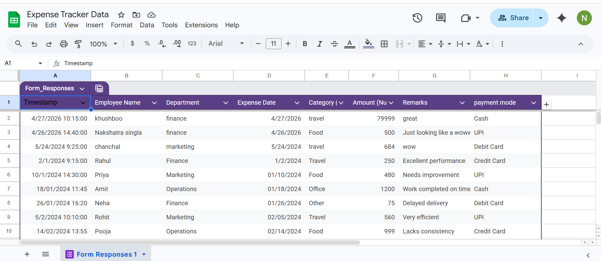
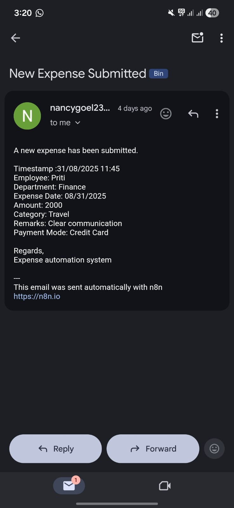

# 💰 AI Finance Expense Automation System

An AI-powered Expense Automation System using **Google Forms, n8n, Google Sheets, and Power BI** for real-time financial tracking, workflow automation, and decision-making insights.

---

# 🚀 Project Overview

This project automates the complete expense management workflow:

1. Users submit expense details through Google Forms  
2. n8n automates data processing and notifications  
3. Google Sheets stores and manages financial data  
4. Power BI creates real-time dashboards and analytics  

The system reduces manual work, improves accuracy, and provides instant financial insights.

---

# 🛠️ Tech Stack

- **Google Forms** – Expense data collection  
- **n8n** – Workflow automation  
- **Google Sheets** – Data storage and processing  
- **Power BI** – Dashboard and analytics visualization  

---

# 📂 Project Architecture

## 🔹 n8n Workflow Architecture


---

# 📸 Screenshots

## 1️⃣ Google Form for Expense Entry


---

## 2️⃣ Google Sheet Data Storage



---

## 3️⃣ Automated Email Notification Output



---

## 4️⃣ Power BI Dashboard


---

# ⚙️ Workflow Process

```text
User submits expense
        ↓
Google Form
        ↓
n8n Automation
        ↓
Google Sheets Storage
        ↓
Email Notification
        ↓
Power BI Dashboard
